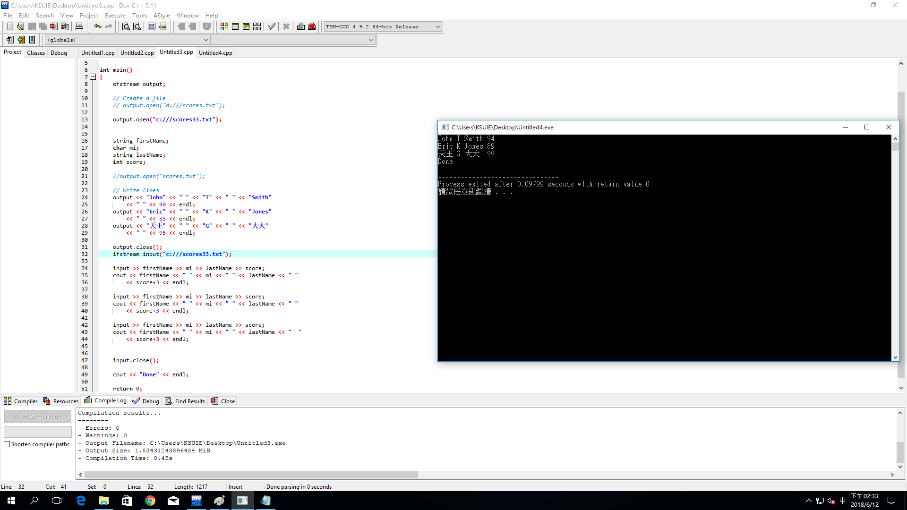

#include <iostream>
#include <fstream>
#include <string>
using namespace std;

int main()
{
    ofstream output;

    // Create a file
    // output.open("d:///scores.txt");
 
    output.open("c:///scores33.txt");
 
 
    string firstName;
    char mi;
    string lastName;
    int score;
 
    //output.open("scores.txt");

    // Write lines
    output << "John" << " " << "T" << " " << "Smith" 
        << " " << 90 << endl;
    output << "Eric" << " " << "K" << " " << "Jones" 
        << " " << 85 << endl;
    output << "天王" << " " << "G" << " " << "大大" 
        << " " << 95 << endl;
    
    output.close();
    ifstream input("c:///scores33.txt");
  
    input >> firstName >> mi >> lastName >> score;
    cout << firstName << " " << mi << " " << lastName << " "
        << score+3 << endl;

    input >> firstName >> mi >> lastName >> score;
    cout << firstName << " " << mi << " " << lastName << " "
        << score+3 << endl;
    
    input >> firstName >> mi >> lastName >> score;
    cout << firstName << " " << mi << " " << lastName << "  "
        << score+3 << endl; 
    
  
    input.close();

    cout << "Done" << endl;

    return 0;
}

======原本以為這樣可以，但做出來的卻不一樣======

======所以我用了別的方法=======

#include <iostream>
#include <fstream>
#include <string>
using namespace std;

int main()
{
   
    ifstream input("c:///scores33.txt");
    
    ofstream output;
 
    output.open("c:///scores31.txt");
    
    string firstName;
    char mi;
    string lastName;
    int score;
  
    input >> firstName >> mi >> lastName >> score;
    cout << firstName << " " << mi << " " << lastName << " "
        << score+4 << endl;
    output << firstName << " " << mi << " " << lastName << " "
        << score+4 << endl;

    input >> firstName >> mi >> lastName >> score;
    cout << firstName << " " << mi << " " << lastName << " "
        << score+4 << endl;
    output << firstName << " " << mi << " " << lastName << " "
        << score+4 << endl;
    
    input >> firstName >> mi >> lastName >> score;
    cout << firstName << " " << mi << " " << lastName << "  "
        << score+4 << endl; 
    output << firstName << " " << mi << " " << lastName << " "
        << score+4 << endl;
    
    output.close();
  
    input.close();

    cout << "Done" << endl;

    return 0;
}

==========這樣就成功了========

